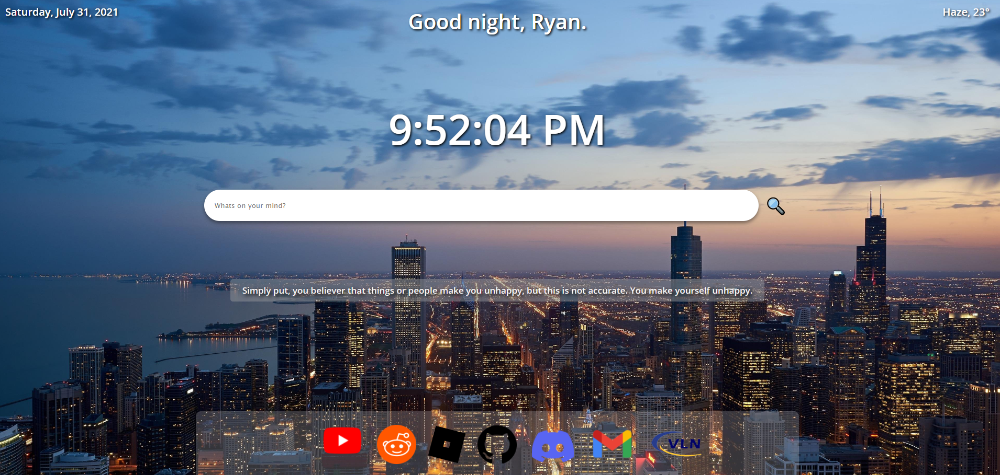

# 🏡Homepage

A personalized new-page-tab/homepage written with basic frontend tools.

# Site

[http://ry4nw.me/homepage/](http://ry4nw.me/homepage/)
- Note: extensions for dark mode, etc. may interfere. Works best on Chrome.

# Features

- Time and date generator (built-in Date objects in JS) along with a greeting that greets according to the time of the day
- A tray of frequently accessed applications
- Random inspirational quote generator using type.fit's [API](https://type.fit/api/quotes)
- Weather generator using OpenWeatherMap's [API](https://openweathermap.org/api)

